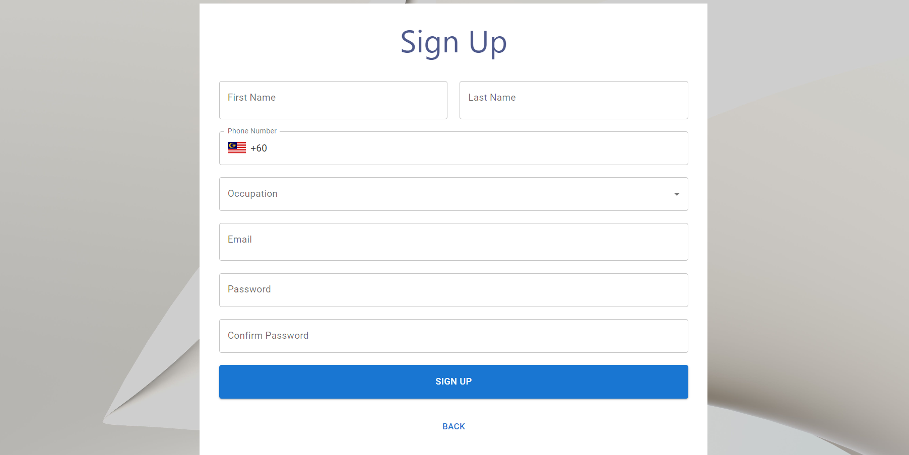
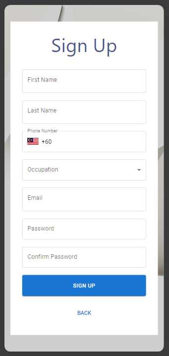

# Sign Up Page Demo

This is a demo of Sign Up page for a fictional Insurtech company.

The Sign Up page has a mobile responsive design and demonstrates multiple input types with built in with real time form validation for facilitating user form filling flow and early warnings if their input are incorrect

## Features

- Mobile responsive sign up form
- Multiple input types
- Real time form validation

## Packages Used

- React TS
- Vite
- Tailwind CSS
- Material UI
- Formik 
- Yup 
- React Router 

## How to Run
1. First run 'npm install'
2. Then run 'npm run dev'

## Preview

Desktop View:

Mobile View:
